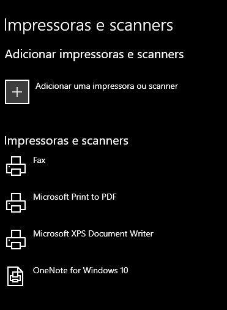
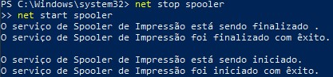

# Problemas com Impressora no Windows

## Sintoma
Impressora não imprime ou permanece com documentos presos na fila de impressão.

## Diagnóstico

### 1. Verificar conexão
Antes de iniciar o troubleshooting, verificar:

- Cabo USB conectado
- Impressora ligada
- Rede conectada (Wi-Fi)

### Impressoras instaladas

Verificação das impressoras reconhecidas pelo Windows



---

### 2. Reiniciar o serviço de impressão (Print Spooler)

O serviço **Print Spooler** é responsável pelo gerenciamento da fila de impressão do Windows. Reiniciar esse serviço pode corrigir falhas comuns de impressão.

#### Comandos executados

```cmd
net stop spooler
net start spooler
```
## Reinicialização do serviço de impressão

Execução dos comandos para reiniciar o serviço **Print Spooler**, utilizando no gerenciamento da fila de impressão do Windows.

### Reinício do serviço



> Objetivo: corrigir falhas de impressão e restaurar o funcionamento do serviço de spooler

---

### 3. Verificar fila de impressão

Acessar:

Configurações → Impressoras → Abrir fila

Verificar:

- Documentos travados
- Impressões pausadas
- Erros de comunicação

---

### 4. Reinstalar driver da impressora

Se o problema persistir: 

1. Remova a impressora instalada
2. Reiniciar o computador
3. Instalar novamente o driver atualizado do frabrincate.

---

## Solução

Após as verificações:

- Reiniciar o computador
- Testar nova impressão
- Validar comunicação entre Windows e impressora