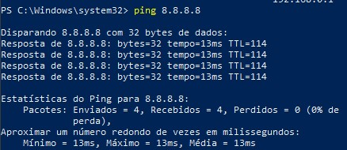
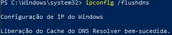
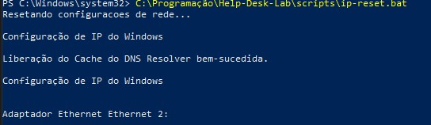

# Problemas de Internet no Windows

## Sintoma

Computador sem acesso à internet ou apresnetando falhas de conectividade.

Possíveis sinais: 
- Navegação indisponível
- Wi-fi conectado sem acesso à internet
- Aplicações sem conexão
- Lentidão ou perda de pacotes

---

## Diagnóstico Inicial

### 1. Verificar conexão física

- Cabo conectado corretamente
- Wi-Fi ativado
- Indicaodr de conexão disponível

> Objetivo: descarta falhas físicas de conectividade.

---

### 2. Testar conectividade

Abrir o Prompt de Comando:

```cmd
ping 8.8.8.8
```

Se houber resposta:

- Internet externa funcionando

Se não houver resposta:

- Verificar configuraões de rede
- Validar IP e gateway

## Teste de connectividade



> Objetivo: validar comunicação com um servidor externo (Google DNS)

---

### 3. Verificar IP

Executar:

```cmd
ipconfig
```

Validar:

- IPv4 atribuído
- Gateway padrão
- Adaptador de rede ativo

> Observação: informações sensíveis de redere foram ocultadas por segurança.

### 4. Renovar configuração de rede

Executar:

```cmd
ipconfig /release
ipconfig /renew
ipconfig /flushdns
```

## Limpeza do cache DNS



> Objetivo: renovar endereço IP e limpar cache DNS do Windows.

---

### 5. Resetar pilha de rede

Executar:

```cmd
netsh winsock reset
netsh int ip reset
```

## Reset de rede automatizado

Execução do script de troubleshooting para renovação de IP, limpeza de cache DNS e reset de Winsock.

### Parte 1 - Execução Inicial



### Parte 2 - Finalização


> Observação: informações sensíveis de rede foram ocultadas por segurança.

## Solução

Após os procedimentos: 

1. Reiniciar o computador
2. Testar conectividade novamente
3. Validar acesso à internet
4. Confirmar estabilidade da rede
