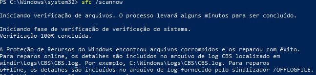

# Computador Lento no Windows

## Diagnóstico

### 1. Verificar inicialização

Abrir:

```cmd
taskmgr
```

Verificar:
- CPU
- Memória RAM
- Disco

### 2. Remover programas da inicialização

Abrir:
Gerenciador de Tarefas → Inicializar

Desabilitar:
- Programas desnecessários

### 3. Limpeza temporária

```cmd
temp
%temp%
prefetch
```

### 4. Verificar integridade do Windows

```cmd
sfc /scannow
```


## Solução
Reiniciar equipamento após manutenção.