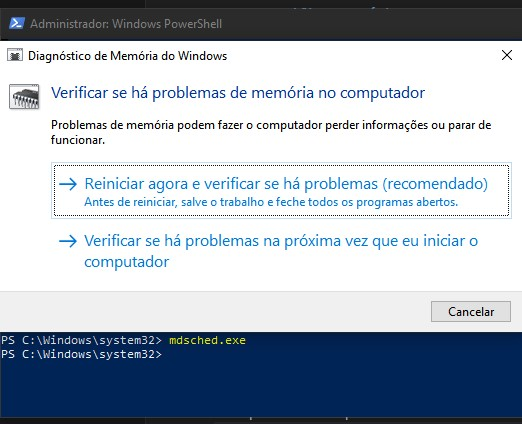

# Tela Azul (BSOD) no Windows

## Sintoma
Windows reiniciando com erro de tela azul.

## Diagnóstico

### 1. Verificar mensagem de erro
Exemplo:
- MEMORY_MANAGEMENT
- CRITICAL_PROCESS_DIED

### 2. Verificar memória RAM

```cmd
mdsched.exe
```


### 3. Verificar arquivos corrompidos

```cmd
sfc /scannow
```


### 4. Verificar disco

```cmd
chkdsk /f
```

## Possíveis causas
- Driver incompatível
- Problema em memória RAM
- Arquivos corrompidos
- HD/SSD com falha